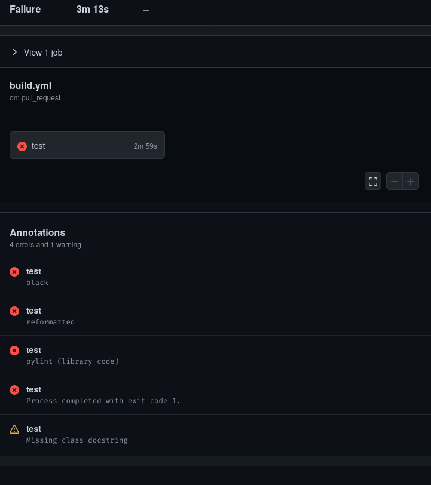
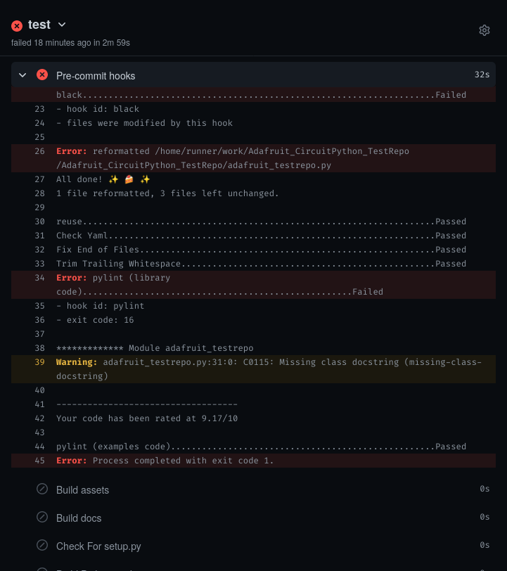
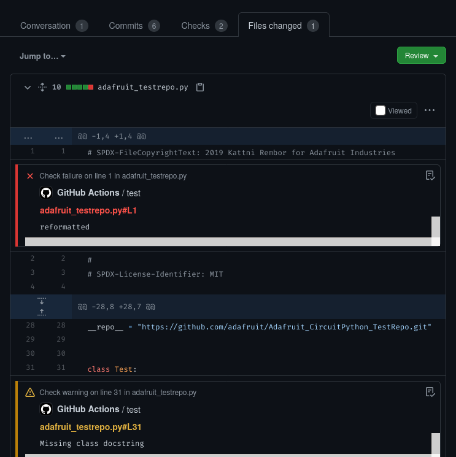

Introduction
============

[](https://discord.gg/adafruit)

This repo centralizes numerous GitHub Actions [problem matchers](https://github.com/actions/toolkit/blob/master/docs/problem-matchers.md) that are used to
highlight errors in CircuitPython library CI runs. It includes matchers for
pre-commit, pylint, black and reuse.

The problems found are listed in a workflow summary:



They are also colored in the log output:


If the matchers also sets file, then an annotation will be placed in the file view too:



Usage
=====

Place this in your GitHub repo before running the tests:

```
    - name: Setup problem matchers
      uses: adafruit/circuitpython-action-library-ci-problem-matchers@v1
```

The problem matchers will automatically be updated with the `v1` tag here.

Contributing
============

Contributions are welcome! Please read our [Code of Conduct](https://github.com/adafruit/Adafruit_CircuitPython_TestRepo/blob/master/CODE_OF_CONDUCT.md)
before contributing to help this project stay welcoming.
